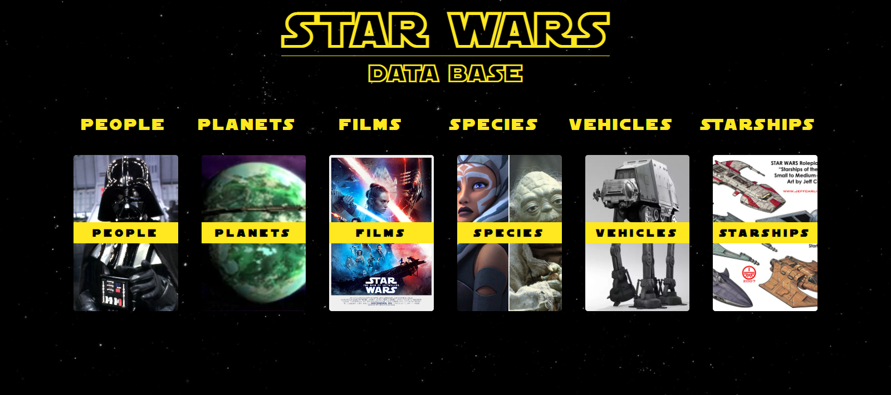

# SWAPI Challenge



This is a solution to the [SWAPI challenge for INFLOR](https://github.com/newbpydev/swapi-challenge).

## Table of contents

- [Overview](#overview)
  - [Screenshot](#screenshot)
  - [Links](#links)
- [My process](#my-process)
  - [Built with](#built-with)
  - [What I learned](#what-i-learned)
  - [Continued development](#continued-development)
  - [Useful resources](#useful-resources)
- [Author](#author)
- [Acknowledgments](#acknowledgments)

## Overview

This is my solution to the SWAPI Challenge. I added a global storage, routing
mechanism, dynamic components such as the menus, pagination, details pane and
related items in the details pane. I added router hooks and used the middleware
functions to update the global storage while going from one route to the other.

### Screenshot


### Links

- Solution URL: [GitHub](https://github.com/newbpydev/05-3-column-preview-card-component-main)
- Live Site URL: [Live Site](https://cocky-poitras-2c8a95.netlify.app/)

## My process

### Built with

- Vue
- Vue-router
- Flexbox
- Grid

### What I learned

I have learned on this project that a proper planning before taking on the
challenge is crucial so that the development phase goes well without much
struggle. As I worked on the project I tried to integrate dynamic components
that will later self evalute and make the correct choice based on what was given
to it from the SWAPI.

This was a new css that I know I will use more frequently in the future:

```css
.disable {
  pointer-events: none;
  opacity: 0.5;
}
```

### Continued development

For future development, I will continue to work on this project so I can add
links for the data such as the characters having a gallery. I wanted to add a my
own API to make this possible, but I only had 4 days to finish the main project,
but I will be working on and enhancing this API so that it can have a short
description from the wikia page and a list of photos urls. Stay tuned.

### Useful resources

- [Vue - Navigation Guards](https://router.vuejs.org/guide/advanced/navigation-guards.html#in-component-guards) - As the name suggests, the navigation guards provided by Vue router are primarily used to guard navigations either by redirecting it or canceling it. There are a number of ways to hook into the route navigation process: globally, per-route, or in-component.

## Author

- Website - [Juan Gomez](https://www.newbpydev.com)
- Twitter - [@Newb_PyDev](https://twitter.com/Newb_PyDev)

## Acknowledgments

The code may not be perfect compared to my sensei @jonasschmedtman but I need
to thank him because he has shown me the ropes and now I am a confident web
designer.
