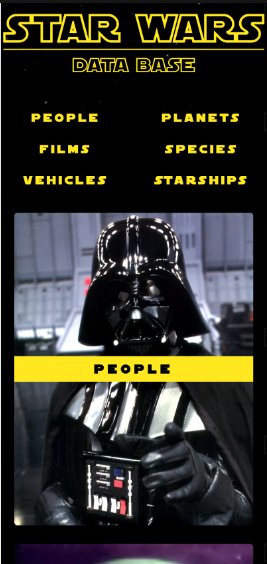

# SWAPI Challenge


This is a solution to the [SWAPI challenge for INFLOR](https://github.com/newbpydev/swapi-challenge).

## Table of contents - Índice

- [Overview](#overview)
  - [Screenshot](#screenshot)
  - [Links](#links)
- [My process](#my-process)
  - [Built with](#built-with)
  - [What I learned](#what-i-learned)
  - [Continued development](#continued-development)
  - [Useful resources](#useful-resources)
- [Author](#author)
- [Acknowledgments](#acknowledgments)

## Overview - Visão geral

This is my solution to the SWAPI Challenge. I added a global storage, routing
mechanism, dynamic components such as the menus, pagination, details pane and
related items in the details pane. I added router hooks and used the middleware
functions to update the global storage while going from one route to the other.

Esta é a minha solução para o Desafio SWAPI. Adicionei armazenamento global,
mecanismo de router e componentes dinâmicos, como menus, paginação, painel de detalhes e
itens relacionados no painel de detalhes. Eu adicionei hooks de router e usei os
middleware hooks para atualizar o armazenamento global ao passar de uma rota para
outra.

### Screenshot




### Links

- Solution URL: [GitHub](https://github.com/newbpydev/swapi-challenge)
- Live Site URL: [Live Site](https://swapi-inflor.onrender.com/)

## My process - Meu processo

### Built with - Construído com

- Vue
- Vue-router
- Flexbox
- Grid

### What I learned - O que eu aprendi

I have learned on this project that proper planning before taking on the
challenge is crucial so that the development phase goes well without much
struggle. As I worked on the project, I tried to integrate dynamic components
that will later self-evaluate and make the correct choice based on what was given
to it from the SWAPI.

Aprendi neste projeto que um planejamento adequado antes de assumir o desafio é
crucial para que a fase de desenvolvimento corra bem sem muito luta. Enquanto
trabalhava no projeto, tentei integrar componentes dinâmicos
que mais tarde se auto-avaliará e fará a escolha correta com base no que foi dado
para ele a partir do SWAPI.

This was a new CSS that I know I will use more frequently in the future:
Este foi um novo CSS que sei que usarei com mais frequência no futuro:

```css
.disable {
  pointer-events: none;
  opacity: 0.5;
}
```

### Continued development - Desenvolvimento contínuo

For future development, I will continue to work on this project so I can add
links for the data such as the characters having a gallery. I wanted to add my
own API to make this possible, but I only had 4 days to finish the main project,
but I will be working on and enhancing this API so that it can have a brief
description from the Wikia page and a list of photos URLs. Stay tuned.

Para desenvolvimento futuro, continuarei trabalhando neste projeto para poder
adicionar links para os dados, como os personagens que têm uma galeria. Eu
queria adicionar minha própria API para tornar isso possível, mas eu só tinha 4
dias para terminar o projeto principal, mas estarei trabalhando e aprimorando
essa API para que ela possa ter uma breve descrição da página da Wikia e uma
lista de URLs de fotos. Fique ligado.

### Useful resources - Recursos úteis

- [Vue - Navigation Guards](https://router.vuejs.org/guide/advanced/navigation-guards.html#in-component-guards) - As the name suggests, the navigation guards provided by Vue router are primarily used to guard navigations either by redirecting it or canceling it. There are a number of ways to hook into the route navigation process: globally, per-route, or in-component.

## Author

- Website - [Juan Gomez](https://www.newbpydev.com)
- Twitter - [@Newb_PyDev](https://twitter.com/Newb_PyDev)

## Acknowledgments - Agradecimentos

The code may not be perfect compared to my sensei @jonasschmedtman but I need
to thank him because he has shown me the ropes and now I am a confident web
designer.
O código pode não ser perfeito comparado ao meu sensei @jonasschmedtman, mas preciso agradecê-lo porque ele me mostrou as cordas e agora sou um web designer e desenvolvedor confiante.
